<h1 align="center"><em>Colors</em> - Assets</h1>

  Centralized documentation, color palettes and media for the Xscriptor ecosystem.

  
  
  
  

<h2 align="center">Contents</h2>
<ul>
  <li><a href="#repository-structure">Repository Structure</a></li>
  <li><a href="#colors">Colors</a></li>
  <li><a href="#usage">Usage</a></li>
  <li><a href="#contributing">Contributing</a></li>
  <li><a href="#security">Security</a></li>
  <li><a href="#license">License</a></li>
  <li><a href="#related-repos">Related Repos</a></li>
  <li><a href="#x">X</a></li>
</ul>

<h2 align="center" id="repository-structure">Repository Structure</h2>

<ul>
  <li><code>docs/</code>: Documentation (<code>palettes.md</code>, per-application palette pages).</li>
  <li><code>palettes/</code>: Palette data as JSON (<code>source.json</code> + one file per application).</li>
  <li><code>media/</code>: Graphic resources (all-palette SVG/JPG, one SVG per palette).</li>
</ul>

<h2 align="center" id="previews">Previews</h2>

  <a href="./media/source.svg">
  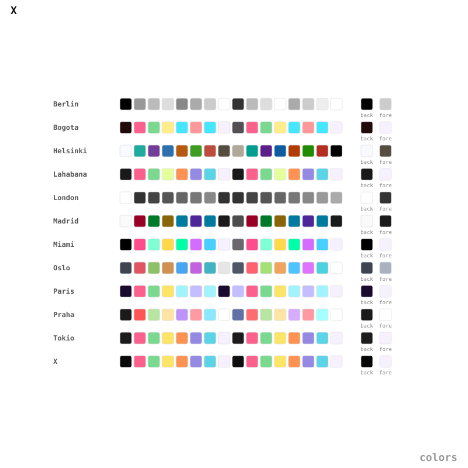
  </a>

<b>Palette cards...</b>

  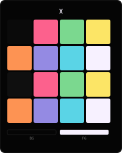
  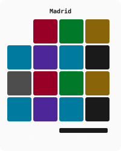
  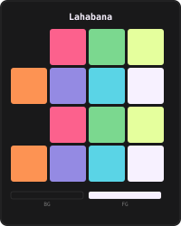
  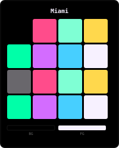
  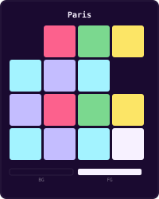
  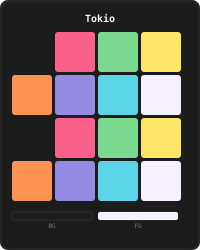

  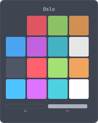
  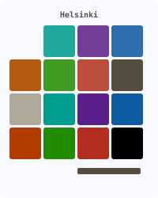
  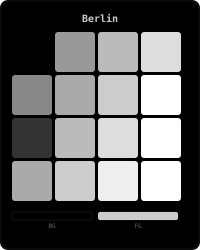
  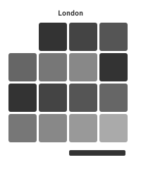
  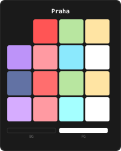
  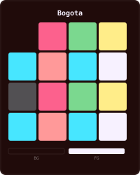

<h2 align="center" id="usage">Usage</h2>

<ul>
  <li>Documentation: read <code><a href="./docs/palettes.md">docs/palettes.md</a></code> or any page under <code>docs/applications/</code>.</li>
  <li>Palette data: use any <code>palettes/*.json</code> (<code><a href="./palettes/source.json">source.json</a></code> is the canonical source).</li>
  <li>Media: reference the SVGs from other READMEs, e.g. <code>https://raw.githubusercontent.com/xscriptor-colors/assets/main/media/palettes/palette_x.svg</code>.</li>
</ul>

<h2 align="center" id="contributing">Contributing</h2>

  Contributions are welcome. See <a href="./CONTRIBUTING.md">CONTRIBUTING.md</a> for workflow and conventions.

<h2 align="center">Community Docs</h2>
<ul>
  <li><a href="./CODE_OF_CONDUCT.md">Code of Conduct</a></li>
  <li><a href="./SUPPORT.md">Support</a></li>
  <li><a href="./CHANGELOG.md">Changelog</a></li>
</ul>

<h2 align="center" id="security">Security</h2>

  To report vulnerabilities, read <a href="./SECURITY.md">SECURITY.md</a> and follow the private disclosure process.

<h2 align="center" id="license">License</h2>

  Repository content is under <a href="./LICENSE">MIT License</a>.

<h2 align="center" id="related-repos">Related Repos</h2>
<ul>
  <li><a href="https://github.com/xscriptor-colors/vscode">VS Code</a></li>
  <li><a href="https://github.com/xscriptor-colors/terminal">Terminal</a></li>
  <li><a href="https://github.com/xscriptor-colors/jetbrains">JetBrains</a></li>
  <li><a href="https://github.com/xscriptor-colors/nvim">Neovim</a></li>
  <li><a href="https://github.com/xscriptor-colors/obsidian">Obsidian</a></li>
  <li><a href="https://github.com/xscriptor-colors/fresh">Fresh</a></li>
  <li><a href="https://github.com/xscriptor-colors/ide">IDE</a></li>
  <li><a href="https://github.com/xscriptor-colors/desktop">Desktop</a></li>
  <li><a href="https://github.com/xscriptor-colors/hyprland">Hyprland</a></li>
</ul>

<h2>X</h2>

 & 

 & 

